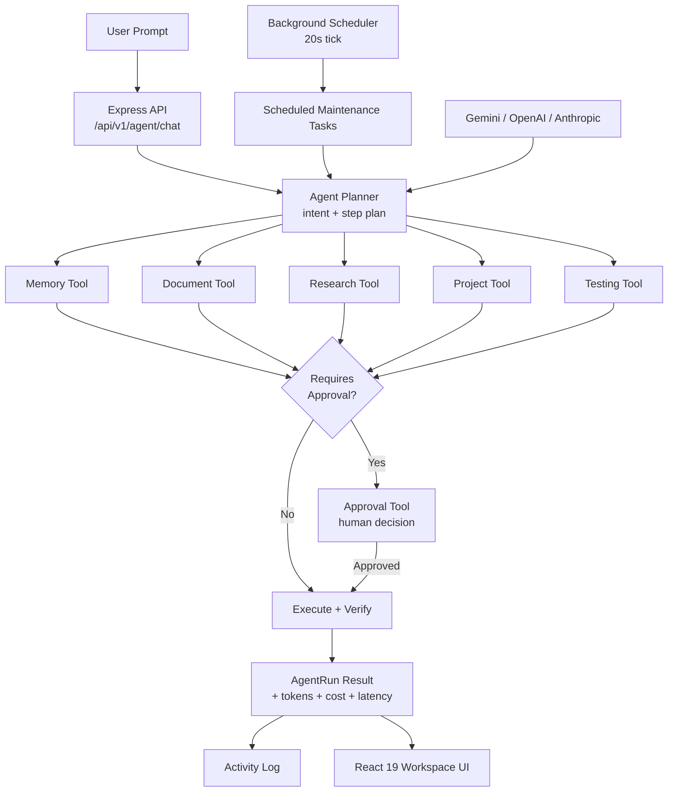

<div align="center">

# 🧬 Gen

### Autonomous AI Work Agent — Full-Stack Project Workspace

**Plan. Build. Test. Deploy. Document. All on autopilot — with a human always holding veto power.**

[](https://gen-ai-agent-zeta.vercel.app/)
[](https://vercel.com)
[](https://react.dev)
[](https://www.typescriptlang.org)
[](https://ai.google.dev)
[](LICENSE)

<br/>

### 🔗 [**⚡ LAUNCH THE LIVE PLATFORM ⚡**](https://gen-ai-agent-zeta.vercel.app/)

**`https://gen-ai-agent-zeta.vercel.app/`**

<br/>

[Overview](#-what-is-this) · [Key Features](#-core-capabilities) · [Architecture](#️-system-architecture) · [Tech Stack](#-tech-stack) · [API Reference](#-api-reference) · [Setup](#-getting-started) · [Deployment](#️-deployment) · [Roadmap](#️-roadmap)

</div>

---

## 🧩 What Is This?

A chatbot answers questions. **Gen runs a workspace.**

It's an autonomous work agent that holds full context on your projects, tasks, documents, research, and past decisions — then takes a request, **plans it as an explicit multi-step sequence, executes each step with the right tool, and asks for your approval before anything consequential happens.** Every run is fully inspectable: the plan, the tools invoked, the token usage, the cost, the latency, and the verification step are all logged, not hidden behind a single opaque reply.

It also doesn't wait to be asked. A background scheduler quietly runs recurring maintenance — summarizing progress, cleaning up stale notifications, consolidating memory, auditing project health — on a cadence you define.

```
User Prompt / Scheduled Trigger
            │
            ▼
   🧠 Agent Planner  ──▶  intent + explicit step plan
            │
   ┌────────┼─────────┬─────────────┬──────────────┐
   ▼        ▼          ▼             ▼              ▼
Memory   Document   Research      Project        Testing
 Tool      Tool        Tool          Tool           Tool
   │        │          │             │              │
   └────────┴──────────┴─────────────┴──────────────┘
            │
            ▼
  ⏸️ Approval Tool (if consequential)  ──▶  human decides
            │
            ▼
  ✅ Result + Verification + Next Actions + Full Audit Trail
```

---

## ✨ Core Capabilities

### 🧠 Transparent Agent Runs
Every request produces a structured `AgentRun`: detected intent, an explicit step-by-step plan, per-step status (`pending → running → completed → failed → waiting_approval`), tools used, token usage, estimated cost, latency, a verification statement, and suggested next actions — nothing is a black box.

### 🛠️ Multi-Tool Execution Pipeline
Five agent tools compose automatically depending on the request:

| Tool | Function |
|---|---|
| **Memory Tool** | Recalls prior decisions, architecture choices, constraints, and preferences |
| **Document Tool** | Retrieves and reasons over uploaded, chunked project documents |
| **Research Tool** | Pulls in external sources with relevance scoring and extracted key facts |
| **Project Tool** | Reads and updates project state, tech stack, and requirements |
| **Testing Tool** | Runs verification logic and reports pass/fail outcomes |

### ⏸️ Human-in-the-Loop Approvals
Actions above a risk threshold pause and surface an `Approval` request — action, target, change count, and full details — before proceeding. Approve or reject with notes; the decision is permanently logged.

### ⏰ Autonomous Maintenance Scheduler
A live background scheduler (default 20-second tick) checks every enabled `ScheduledTask` against its `nextRunAt` timestamp and fires it automatically — daily, weekly, biweekly, monthly, or custom-hour intervals — for recurring jobs like `summarize_progress`, `cleanup_notifications`, `consolidate_memory`, and `audit_health`. Every execution is recorded with duration, items affected, and a result summary.

### 📁 Full Project & Task Management
Projects carry status, tech stack, progress, deadlines, requirements, architecture topology, repo URL, and live deployed URL. Tasks carry priority, category, status, assignee, dependencies, and due dates — a real project tracker, not a toy list.

### 📚 Knowledge Memory & RAG Documents
A persistent memory store categorized by decision, architecture, constraint, preference, requirement, and pattern — plus document ingestion with chunking, tagging, and full-text retrieval for grounded answers.

### 🔬 Research Aggregation
Structured research capture per query — title, URL, snippet, relevance score, source, and extracted key facts — tied back to the project that needs it.

### 📧 Intelligent Email Triage
Simulated inbox monitoring that detects deadlines and suggested actions inside email content, with one-click task creation from a flagged message.

### 🐙 GitHub & Deployment Awareness
Live view of repo branch state, last commit, open PRs, and star count, alongside a deployment tracker across **Vercel, Render, Railway, Docker, and AWS** — environment, status, commit hash, and logs per deployment.

### 🏆 Hackathon Tracking
Purpose-built tracking for hackathon entries — organizer, deadlines, problem statement, team, judging criteria, required deliverables, and submission status.

### 🎞️ AI PPT Studio
Generates full pitch-deck structures — per-slide titles, bullets, speaker notes, and demo cues — plus a complete demo script, ready to present.

### 🔔 Notifications & Activity Log
A prioritized notification feed (`critical → high → medium → low → info`) alongside a complete activity log spanning agent runs, tool calls, approvals, task updates, deployments, and memory changes.

### ⌨️ Command Palette
Keyboard-driven navigation across every view in the workspace — projects, tasks, documents, research, memory, hackathons, emails, GitHub, deployments, PPT studio, and settings.

---

## 🏗️ System Architecture



**Flow:** a prompt or a scheduled trigger reaches the planner → the planner determines intent and lays out an explicit step plan → each step invokes the right tool → any consequential action pauses for human approval → the run completes with a verification statement, cost/latency metrics, and suggested next actions → everything is written to the activity log and reflected live across the workspace.

---

## 🧰 Tech Stack

| Layer | Technology |
|---|---|
| **Frontend** | React 19, TypeScript, Vite 8, Tailwind CSS 4 |
| **UI / UX** | Lucide React icons, Motion (animations), Command Palette |
| **Backend** | Node.js, Express 4, TypeScript (`tsx` / `esbuild`) |
| **AI Engines** | Google Gemini (`@google/genai`), with OpenAI (GPT-4o) and Anthropic (Claude 3.5) support |
| **Scheduling** | Custom in-process interval scheduler with persistence |
| **Deployment** | Vercel |

---

## 🚀 Getting Started

### Prerequisites
- **Node.js 18+**
- A **Google Gemini API key** — [get one here](https://aistudio.google.com/apikey)
- *(Optional)* OpenAI and/or Anthropic API keys for additional model support

### Installation

```bash
# 1. Clone the repository
git clone https://github.com/sathi2305/GEN_AI_AGENT.git
cd GEN_AI_AGENT

# 2. Install dependencies
npm install

# 3. Configure environment
cp .env.example .env
# add your API keys to .env

# 4. Start the dev server
npm run dev
```

The app runs at **http://localhost:3000**

### Environment Variables

```env
GEMINI_API_KEY="your_gemini_api_key"
APP_URL="http://localhost:3000"

# Optional — enables additional model engines
OPENAI_API_KEY=
ANTHROPIC_API_KEY=
```

> 🔐 `.env` is gitignored — never commit API keys. Rotate immediately if one is ever exposed.

### Available Scripts

| Command | Description |
|---|---|
| `npm run dev` | Dev server with Vite middleware + HMR |
| `npm run build` | Build client (Vite) and bundle server (esbuild) |
| `npm start` | Run the production build |
| `npm run preview` | Preview the built client |
| `npm run lint` | Type-check with `tsc --noEmit` |
| `npm run clean` | Remove build artifacts |

---

## 🔌 API Reference

**Base URL:** `https://gen-ai-agent-zeta.vercel.app/api/v1`

### Agent
| Method | Endpoint | Description |
|---|---|---|
| `POST` | `/agent/chat` | Send a prompt — runs the full plan/tool/approval pipeline |
| `POST` | `/agent/stream` | Streaming variant of the agent chat pipeline |
| `GET` | `/stats` | Dashboard summary statistics |

### Projects & Tasks
| Method | Endpoint | Description |
|---|---|---|
| `GET` / `POST` | `/projects` | List or create projects |
| `GET` / `POST` | `/tasks` | List or create tasks |
| `DELETE` | `/tasks/:id` | Delete a task |

### Scheduler
| Method | Endpoint | Description |
|---|---|---|
| `GET` / `POST` | `/schedules` | List or create scheduled maintenance tasks |
| `GET` | `/schedules/executions` | List scheduled task execution history |
| `GET` | `/schedules/:id` | Get a single scheduled task |
| `DELETE` | `/schedules/:id` | Delete a scheduled task |
| `POST` | `/schedules/:id/run` | Manually trigger a scheduled task immediately |

### Knowledge & Research
| Method | Endpoint | Description |
|---|---|---|
| `GET` / `POST` | `/documents` | List or upload RAG documents |
| `GET` / `POST` | `/research` | List or add research sources |
| `GET` / `POST` | `/memories` | List or add knowledge memory entries |

### Approvals & Notifications
| Method | Endpoint | Description |
|---|---|---|
| `GET` | `/approvals` | List pending/decided approvals |
| `POST` | `/approvals/:id/approve` | Approve a pending action |
| `POST` | `/approvals/:id/reject` | Reject a pending action |
| `GET` | `/notifications` | List notifications |

### Integrations
| Method | Endpoint | Description |
|---|---|---|
| `GET` | `/hackathons` | List tracked hackathon entries |
| `GET` | `/emails` | List inbox items with detected deadlines/actions |
| `POST` | `/emails/simulate` | Simulate an incoming email for triage |
| `GET` | `/deployments` | List deployments across platforms |
| `POST` | `/deployments/trigger` | Trigger a new deployment |

### Activity & Messaging
| Method | Endpoint | Description |
|---|---|---|
| `GET` | `/activity` | Full activity log |
| `GET` / `POST` | `/messages` | List or send conversation messages |
| `GET` | `/health`, `/api/health` | Service health check |

---

## 🗂️ Project Structure

```
GEN_AI_AGENT/
├── server.ts                          # Express bootstrap, 30+ API routes
├── vite.config.ts                     # Vite + React + Tailwind config
├── index.html                         # App shell
├── .env.example                       # Environment template
└── src/
    ├── main.tsx                       # React entry point
    ├── App.tsx                        # Root state & view routing
    ├── types/index.ts                 # Project, Task, AgentRun, Schedule types
    ├── lib/api.ts                     # Frontend API client
    ├── server/
    │   ├── agent.ts                   # Multi-model agent planner & tool execution
    │   ├── scheduler.ts               # Background maintenance scheduler
    │   └── db.ts                      # In-memory data store
    ├── components/
    │   ├── TopBar.tsx                  # Global header
    │   ├── Sidebar.tsx                 # View navigation
    │   └── CommandPalette.tsx          # Keyboard-driven command menu
    └── views/
        ├── DashboardView.tsx            # Overview & stats
        ├── ProjectsView.tsx              # Project management
        ├── TasksView.tsx                 # Task board
        ├── AgentChatView.tsx             # Agent run console
        ├── ScheduledTasksView.tsx        # Maintenance scheduler UI
        ├── DocumentsView.tsx             # RAG document management
        ├── ResearchView.tsx              # Research capture
        ├── KnowledgeMemoryView.tsx       # Memory browser
        ├── CodingTestingView.tsx         # Coding & test verification
        ├── HackathonsView.tsx            # Hackathon tracker
        ├── EmailsView.tsx                # Email triage
        ├── GitHubView.tsx                # Repo status
        ├── DeploymentsView.tsx           # Deployment tracker
        ├── PPTStudioView.tsx             # AI pitch-deck generator
        ├── ActivityLogView.tsx           # Full audit trail
        ├── NotificationsView.tsx         # Notification center
        ├── DocumentationView.tsx         # In-app docs
        └── SettingsView.tsx              # Preferences & API keys
```

---

## ☁️ Deployment

Deployed on **Vercel**.

| Setting | Value |
|---|---|
| **Framework Preset** | Vite |
| **Build Command** | `npm run build` |
| **Output Directory** | `dist` |
| **Environment Variables** | `GEMINI_API_KEY` (required, secret); `OPENAI_API_KEY`, `ANTHROPIC_API_KEY` (optional, secret) |

**Live URL:** https://gen-ai-agent-zeta.vercel.app/

---

## 🗺️ Roadmap

- [ ] Persistent database replacing in-memory project/task/memory store
- [ ] Real GitHub API integration (currently simulated repo state)
- [ ] Real email provider integration (currently simulated inbox)
- [ ] Live deployment webhooks from Vercel/Render/Railway instead of manual triggers
- [ ] Multi-user workspaces with role-based approval permissions
- [ ] Exportable PPT decks as downloadable `.pptx` files
- [ ] Configurable risk thresholds for what requires human approval

---

## 🤝 Contributing

```bash
git checkout -b feature/your-feature-name
git commit -m "Add: clear description of your change"
git push origin feature/your-feature-name
# Open a Pull Request
```

Run `npm run lint` before submitting. When adding a new agent tool, register it in `src/server/agent.ts` and extend the relevant types in `src/types/index.ts`.

---

## 📄 License

Distributed under the MIT License. See [`LICENSE`](LICENSE) for details.

---

## 👤 Author

**Sathiyamoorthi**

[](https://github.com/sathi2305)

---

<div align="center">

### ⭐ If this project helps you, consider starring the repository.

**[🧬 Try the Live Platform](https://gen-ai-agent-zeta.vercel.app/)**

*An agent that plans, acts, and knows when to ask first.*

</div>
